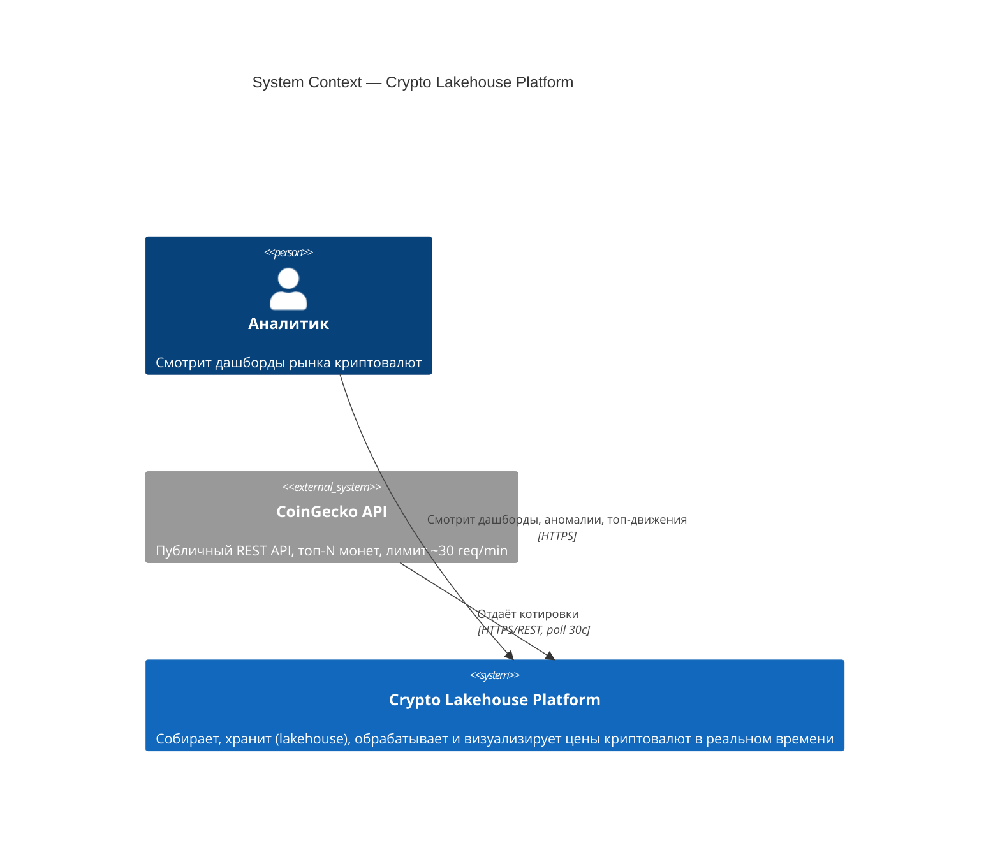
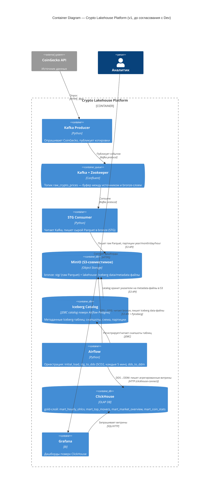

# Этап 1 — Выбор нотации и проектирование архитектуры Data Lakehouse

## 1. Выбор нотации: C4 Model

**Выбрана нотация C4** (Context → Container; уровни Component/Code опущены — см. обоснование ниже).

### Почему C4, а не UML или ArchiMate

| Критерий | C4 | UML | ArchiMate |
|---|---|---|---|
| Аудитория | Один и тот же набор диаграмм читают и PO, и разработчик — просто останавливаются на разном уровне зума | Нужно несколько разных типов диаграмм (deployment + component + sequence), у каждого свой синтаксис — PO их не читает | Три слоя (business/application/technology) и десятки типов связей — избыточно для проекта без бизнес-слоя |
| Порог входа | Прямоугольники + подписанные стрелки, легенда из 4 уровней абстракции | Нужно знать нотацию конкретного вида диаграммы (класс ≠ activity ≠ deployment) | Нужно знать формальную семантику связей (triggering, flow, serving, realization...) |
| Конкретность | На уровне Container можно прямо написать "Kafka", "Iceberg REST Catalog", "ClickHouse" — то, что реально обсуждает разработчик | Компонентная диаграмма ближе к коду, чем к инфраструктуре | Элементы абстрагируются до "Application Component" — конкретные технологии не показывает |
| Хранение/версионирование | Текстовый DSL (Mermaid), diff читается в git, рендерится прямо в README/PR | Требует специального инструмента (StarUML/Enterprise Architect) для читаемого вида | То же самое — обычно Archi-файл, бинарный или XML |

**Честный минус C4**, который признаю: он хуже UML sequence-диаграмм показывает точный порядок операций (например, порядок шагов SCD2-merge) и хуже ArchiMate показывает связь с бизнес-стратегией/портфелем приложений. Ни то, ни другое здесь не требуется — проект состоит из одного сервиса с плоской технической архитектурой, без бизнес-слоя над ней.

Уровни **Component** и **Code** не рисую: в проекте такого масштаба один Container практически всегда равен одному деплою (один DAG-файл, один docker-сервис) — Component-диаграмма продублировала бы Container-диаграмму почти один в один.

---

## 2. Границы системы

**Внутри системы** ("Crypto Lakehouse Platform"): Kafka + Zookeeper, STG-consumer, MinIO (object storage), Iceberg-каталог, Airflow, ClickHouse, Grafana, DuckDB (ad-hoc движок).

**Снаружи системы**: CoinGecko REST API (источник данных, мы не контролируем его аптайм/лимиты — поэтому продюсер учитывает 429 retry), Аналитик/пользователь (потребляет дашборды через браузер, не имеет доступа внутрь системы).

---

## 3. C4 Context Diagram

---

## 4. C4 Container Diagram (первая версия — предложена на согласование)

> Эта версия каталога (**JDBC поверх Postgres, который уже поднят для Airflow**) — предложение архитектора на этапе проектирования: экономия одного контейнера, переиспользование существующей БД. При передаче разработчику это решение изменилось — см. [Этап 2](stage2-po-dev-alignment.md).

---

## 5. Обоснование выбора каждого сервиса (ADR-lite)

### ADR-1: Message broker — **Kafka**, не RabbitMQ / Pulsar

- **Контекст**: нужен буфер между внешним API-поллером и STG-слоем, переживающий падение любой из сторон.
- **Альтернативы**:
  - *RabbitMQ* — проще в эксплуатации, но модель "очередь + consumer ack" плохо подходит для повторного чтения истории (replay), а log-retention Kafka — это ровно то, что нужно, чтобы STG-consumer мог быть перезапущен и не потерять окно.
  - *Pulsar* — архитектурно интереснее (разделение compute/storage, tiered storage), но тяжелее в эксплуатации (BookKeeper + ZooKeeper + Pulsar broker — 3 системы вместо одной) и явно избыточен для одного топика с низким throughput.
- **Решение**: Kafka — индустриальный стандарт для этого паттерна, простая docker-compose эксплуатация, встроенный replay через offset.
- **Trade-off**: Zookeeper — дополнительный контейнер и точка отказа; для проекта такого масштаба это оверинжиниринг сам по себе, но зато прямой аналог того, что используется в проде — ценно для учебной цели.

### ADR-2: Table format — **Apache Iceberg**, не Delta Lake / Hudi

- **Контекст**: DDS-слою нужен открытый table format с ACID, чтобы заменить ручной full-file rewrite parquet.
- **Альтернативы**:
  - *Delta Lake* — самый узнаваемый бренд (Databricks), но полноценно раскрывается только со Spark; без Spark работает через `delta-rs` — менее зрелую биндинг-библиотеку с более узким API (на момент выбора хуже поддерживала произвольные Python-движки для чтения).
  - *Apache Hudi* — сильнее заточен под потоковые upsert с очень высокой частотой записи, но экосистема Python-only (без Spark/Flink) заметно менее документирована, а сама библиотека тяжелее в конфигурации (indexing-стратегии, compaction-сервисы).
- **Решение**: Iceberg — полноценно работает из чистого Python через `pyiceberg`, не требует JVM/Spark (мы и так отказались от Spark в пользу pandas — см. README, раздел "Проектные решения"), REST-каталог — открытый протокол, к которому можно подключить любой движок (Spark, Trino, DuckDB) без переписывания клиента.
- **Trade-off**: экосистема инструментов вокруг Iceberg (compaction, оптимизация) более зрелая в Java-мире, чем в pyiceberg — в проекте это не критично при нашем объёме данных (<10k строк/час).

### ADR-3: Serving/OLAP — **ClickHouse**, не Druid / Doris

- **Контекст**: gold-слою нужна OLAP-БД с быстрыми агрегатами для дашбордов (top movers, market overview).
- **Альтернативы**:
  - *Apache Druid* — сильнее заточен под real-time-индексацию и очень высокий rate событий, но требует связки из 6+ отдельных процессов (coordinator, overlord, broker, historical, middle manager, router) — непропорционально тяжело для 4 витрин с почасовым обновлением.
  - *Apache Doris* — интересная MPP-альтернатива с хорошей MySQL-совместимостью, но заметно менее распространена в русскоязычном учебном контенте и имеет меньшее community — выше риск не найти решение проблемы при отладке в сжатые сроки практики.
- **Решение**: ClickHouse — один бинарник/контейнер, `ReplacingMergeTree` даёт идемпотентные перезаписи витрин "из коробки", нативная интеграция с Grafana.
- **Trade-off**: ClickHouse — это отдельная копия данных, а не прямой запрос к lakehouse (см. честный разбор в ретроспективе, Этап 3).

### ADR-4: Ad-hoc/движок прямого доступа к lakehouse — **DuckDB**, не Trino / Presto / Spark SQL

- **Контекст**: нужно продемонстрировать, что Iceberg-таблицы читаются независимым движком напрямую, без ClickHouse — это часть "доказательства", что DDS реально lakehouse, а не просто parquet под ClickHouse.
- **Альтернативы**:
  - *Trino* — "правильный" production-выбор для многопользовательского federated SQL поверх lakehouse, но это отдельный кластер координатор+worker'ы — тяжеловесно для демонстрации одного факта (прямой доступ возможен).
  - *Presto* — исторический предшественник Trino, та же проблема веса, плюс сообщество меньше активности после форка.
  - *Spark SQL* — потребовал бы вернуть JVM/Spark, которого мы сознательно избежали ещё на этапе STG (см. README).
- **Решение**: DuckDB — embedded-движок без отдельного процесса, `duckdb.sql("SELECT * FROM iceberg_scan(...)")` работает за секунды локально, идеально для демо-скрипта и разовой аналитики.
- **Trade-off**: DuckDB не годится как постоянно работающий сервис, к которому подключается Grafana по сети — это осознанное ограничение, не задача для этого движка.

### ADR-5: Оркестрация — **Airflow**, не Dagster / Prefect

- **Контекст**: нужен scheduler для батчевых DAG'ов STG→DDS→DDM с зависимостями.
- **Альтернативы**: *Dagster* — более современная типизация активов (software-defined assets), *Prefect* — более лёгкий и питонический API. Обе интереснее для гринфилд-проекта.
- **Решение**: Airflow — образовательный стандарт (курс и большинство учебных материалов рассчитаны на Airflow), богатейшая документация под конкретные боли (retries, backfill), и весь остальной стек курса уже подразумевает Airflow.
- **Trade-off**: у Airflow тяжёлый рантайм (собственный Postgres + webserver + scheduler) относительно объёма DAG-логики в проекте — но это цена за соответствие стандарту курса.

### ADR-6: Object storage — **MinIO**, не HDFS

- **Контекст**: нужно S3-совместимое хранилище под data lake, локально в Docker.
- **Решение**: MinIO — de facto стандарт для локальной эмуляции S3, Iceberg/PyIceberg/DuckDB одинаково умеют работать и с MinIO, и с реальным AWS S3 — при переезде в облако меняется только endpoint. HDFS потребовал бы NameNode/DataNode кластер и JVM, которого мы избегаем.

### ADR-7: BI — **Grafana**, не Superset / Metabase

- **Контекст**: нужны дашборды поверх ClickHouse-витрин.
- **Решение**: у Grafana нативный, зрелый ClickHouse data source plugin, легковесный контейнер, знаком по курсу. Superset и Metabase дают более "аналитический" UX (self-service SQL для нетехнического пользователя), но это не требуется — здесь нужны фиксированные операционные дашборды, а не self-service BI.

---

## Артефакт

- Диаграммы: `C4Context` + `C4Container` (выше, Mermaid).
- Документ с обоснованием: этот файл.
