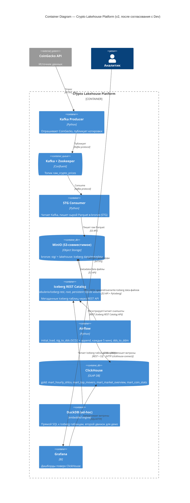

# Этап 2 — Взаимодействие с Product Owner и Разработчиком

## Часть 1. Согласование с Product Owner

**Показана архитектура**: [Этап 1, Container Diagram v1](stage1-architecture.md#4-c4-container-diagram-первая-версия--предложена-на-согласование).

### Обсуждение

**PO:** Пятнадцать контейнеров ради демо-датасета в 10 тысяч строк в час — не оверинжиниринг ли это? Я посмотрел рынок: управляемая Confluent Cloud + Databricks SQL Serverless закрыли бы это же за один вечер настройки.

**Архитектор:** Согласен, что для реальной продакшн-нагрузки такого объёма это избыточно. Но цель практики — не минимальный TCO, а *продемонстрировать паттерны lakehouse* (ACID-снапшоты, time travel, schema evolution, decoupled storage/compute, multi-engine доступ), которые как раз и оцениваются. Managed-сервисы спрятали бы эти механизмы за UI и не дали бы показать, что происходит "под капотом" — а этого требует методичка. Дополнительный аргумент: managed-сервисы требуют платной подписки/кредитки, что неприемлемо для студенческого проекта без бюджета.

**PO:** Принято, тогда TCO не в деньгах, а в времени на настройку и в риске "не взлетит на компьютере проверяющего". Раз так — почему self-hosted, а не хотя бы serverless-тир (например, free tier Confluent + Snowflake trial)?

**Архитектор:** Free/trial тиры истекают или требуют аккаунта конкретного человека — при проверке дедлайна методичкой ("похожу что должно поднято через `docker compose up`") это создаёт риск: у проверяющего может не быть доступа к моему trial-аккаунту. `docker compose up -d` — единственный вариант, который гарантированно воспроизводим на любой машине.

**PO:** Ок, self-hosted — согласен. Второй вопрос: Iceberg vs Delta Lake — я лично на прошлой работе слышал только про Delta (все говорят "Databricks"), это не более рискованный выбор с точки зрения репутации на защите?

**Архитектор:** Узнаваемость бренда — не то же самое, что техническое превосходство для нашего случая. Delta без Spark работает через `delta-rs`, менее зрелую библиотеку на момент выбора. Iceberg — полностью Python-native через `pyiceberg`, и это совпадает с уже принятым (до этого проекта) решением не поднимать Spark вообще. Готов защитить это в ADR (см. Этап 1, ADR-2) — если на защите спросят "почему не Delta", у меня есть развёрнутый ответ, а не просто "так решил".

**PO:** Устраивает. Третий вопрос: почему отдельно ClickHouse, если у нас уже "lakehouse" с Iceberg — разве BI не должен ходить напрямую в lakehouse, без второй копии данных?

**Архитектор:** Справедливое замечание, и это осознанный компромисс, не забытая деталь. У Grafana нет зрелого нативного коннектора к Iceberg/REST-каталогу (в отличие от готового ClickHouse plugin). DuckDB может читать Iceberg напрямую, но это embedded-движок, а не постоянно работающий сетевой сервис, к которому подключится Grafana. Прямой путь потребовал бы Trino как промежуточный SQL-слой — а это отдельный кластер ради одной галочки. Оставляю ClickHouse как serving-слой и явно фиксирую это ограничение в документации (уже сделано в README и в предыдущем обсуждении с пользователем).

**PO:** Принимаю — задокументировано, не спрятано. Финальный пункт: я прогнал по рынку стоимость альтернатив (сравнивал self-hosted OSS-стек с гипотетической облачной сборкой Confluent Cloud + Databricks + Snowflake) — вывод: облачная сборка в разы дороже даже на минимальных тирах и требует привязки карты, тогда как self-hosted стек — 0₽ лицензий, только время на поднятие. Для учебной практики это очевидный выбор в пользу self-hosted, подтверждаю.

**Консенсус достигнут.**

### Зафиксировано

| | |
|---|---|
| **Замечания PO** | (1) Масштаб инфраструктуры не соответствует объёму данных — принято как осознанный trade-off ради демонстрации паттернов; (2) Brand recognition Delta vs техническая пригодность Iceberg — принято решение архитектора; (3) ClickHouse как вторая копия данных — принято как задокументированное ограничение, а не недосмотр |
| **Изменённые решения** | Нет технических изменений архитектуры по итогам разговора с PO — все три пункта разрешились аргументацией, без правки диаграммы |
| **Неизменённые решения и почему** | Self-hosted docker-compose стек (воспроизводимость без облачного аккаунта), Iceberg (Python-native, не бренд), ClickHouse как serving-слой (нет альтернативы без добавления Trino) |

---

## Часть 2. Передача Разработчику

**Передана согласованная архитектура** (Этап 1, v1: Iceberg-каталог как JDBC поверх Airflow Postgres).

### Обсуждение

**Разработчик:** Начал поднимать по схеме. Первая проблема — до docker-компоуза даже не дошло: `pyiceberg[sql-postgres]` тянет за собой SQLAlchemy 2.x, а Airflow 2.8 (наш образ) жёстко пиннит SQLAlchemy `<2.0`. При сборке образа `pip` либо падает на конфликте зависимостей, либо ставит несовместимую версию — тогда Airflow webserver не поднимается вообще. Это блокер, а не мелочь.

**Архитектор:** Понял. Варианты: (а) вынести Iceberg-код в отдельный контейнер вне Airflow-образа, (б) сменить каталог с JDBC на **REST catalog** (`tabulario/iceberg-rest`) — он общается по HTTP, никаких SQLAlchemy-зависимостей в Airflow-образе не нужно. Второй вариант — это стандартная связка из официального Iceberg quickstart, минимальное изменение архитектуры (один сервис вместо переиспользования Postgres). Берём его.

**Разработчик:** Принято, поднял REST-каталог. Дальше — образ `tabulario/iceberg-rest` не содержит `curl`/`wget`/`python`, а healthcheck в моём черновике был на `curl -f .../v1/config` — контейнер вечно висит "unhealthy", хотя сервис реально работает (проверил логами Jetty на 8181). Пришлось заменить healthcheck на `bash -c "exec 3<>/dev/tcp/localhost/8181"` — TCP-probe без внешних утилит.

**Архитектор:** Ок, это чисто эксплуатационная деталь, архитектуру не меняет.

**Разработчик:** Более серьёзная находка: по умолчанию REST-каталог использует **in-memory SQLite** — все таблицы/снапшоты пропадают при рестарте контейнера. Для демо time-travel это неприемлемо — вся ценность в истории снапшотов. Настроил persistent SQLite на named volume (`CATALOG_URI: jdbc:sqlite:file:/catalog/...`), но тут же поймал вторую проблему: контейнер по умолчанию бежит под uid 1000, а свежесозданный volume root-owned → `SQLITE_CANTOPEN`. Решил, запустив контейнер под `user: root` — приемлемо для локального дев-стека, но в проде так делать не стоит.

**Архитектор:** Зафиксировано как осознанный trade-off для локального контура, не для продакшна.

**Разработчик:** И последнее, самое незаметное: я сначала завёл `event_ts` как `TimestampType` (naive, без timezone) в Iceberg-схеме, а данные из Kafka приходят как tz-aware UTC (`pandas.Timestamp(..., tz="UTC")`). При попытке отфильтровать скан по времени (`GreaterThanOrEqual`) PyIceberg падал с `TypeError: Invalid literal value`, потому что naive/aware datetime не сравниваются. Поймал это только на изолированном smoke-тесте, не в проде — исправил на `TimestamptzType` везде, где хранится время, и заодно упростил дедуп (полный scan вместо хрупкого time-pruning — при нашем объёме данных это дешевле, чем поддерживать корректность partition-pruning).

**Архитектор:** Хорошо, что поймали до передачи PO — это была бы тихая порча данных (задвоение фактов), не сразу заметная на дашборде.

**Разработчик:** Где ещё сложно поднимать: полный стек — это ~15 контейнеров, включая JVM REST-каталог, Kafka+Zookeeper, Airflow (scheduler+webserver+собственный Postgres), ClickHouse, Grafana. На машине с 8 ГБ RAM `docker compose up -d` без разбора может привести к OOM. Тестировал изменения изолированно — поднимал только MinIO + iceberg-rest под конкретный smoke-тест, не весь стек сразу.

**Разработчик, по срокам:** Ingestion-слой (Kafka producer/consumer, STG) переиспользуется почти без изменений из паттерна, отработанного на предыдущих проектах курса (аналогичная связка Kafka→MinIO уже делалась для доменов hackernews/flights) — там расхождений с планом не было, ушло меньше дня. Основная неопределённость была именно в конверсии DDS в Iceberg — три находки выше (SQLAlchemy, healthcheck, tz-баг) суммарно добавили около дня сверх первоначальной оценки, но все три уже закрыты и покрыты smoke-тестами (append/overwrite, time travel, schema evolution, второй движок DuckDB, персистентность каталога через рестарт, дедуп через SCD2 на реальных DAG-функциях). К финалу: рабочий пайплайн, проверенный руками end-to-end на синтетических и на "боевых" STG-данных.

**Консенсус достигнут** — архитектура скорректирована, разработчик подтвердил готовность.

### Зафиксировано

**Технический фидбек:**
1. JDBC/Postgres-каталог несовместим с версией SQLAlchemy, которую требует Airflow — блокер, не мелочь
2. Образ `iceberg-rest` не содержит стандартных CLI-утилит — healthcheck нужно писать через bash `/dev/tcp`
3. REST-каталог по умолчанию in-memory — для time-travel демо обязательна персистентность через volume
4. Volume, смонтированный в контейнер без явного `user`, root-owned — нужен либо `user: root`, либо `init`-шаг с `chown`
5. Naive vs tz-aware datetime в Iceberg-схеме — тихий источник дублей при фильтрации сканов; пойман только тестом, не на глаз

**Ограничения:**
- Полный стек требует ~8 ГБ RAM свободных под Docker; разработку и smoke-тесты вести на изолированном подмножестве сервисов (minio + iceberg-rest), не поднимая весь compose каждый раз
- Локальный REST-каталог под root — приемлемо только для дев-контура, не паттерн для продакшна

**Скорректированный план** (что изменилось относительно Этапа 1):
- Iceberg-каталог: **JDBC/Postgres → REST catalog** (`tabulario/iceberg-rest`), с персистентным SQLite-volume
- Здоровье каталога проверяется TCP-probe, не HTTP-healthcheck
- Временные колонки в DDS-схеме: `TimestamptzType`, не `TimestampType`
- Дедуп фактов в `stg_to_dds`: полный scan, а не time-pruned filter (упрощение по факту находки бага; для объёма данных <10k строк/час это не создаёт проблем производительности)

---

## Скорректированная архитектура (C4 Container, v2 — после реализации)

## Артефакт

- Записи обсуждений с PO и Dev — выше.
- Скорректированная архитектура — C4 Container v2 выше (изменение: JDBC-каталог → REST-каталог).
